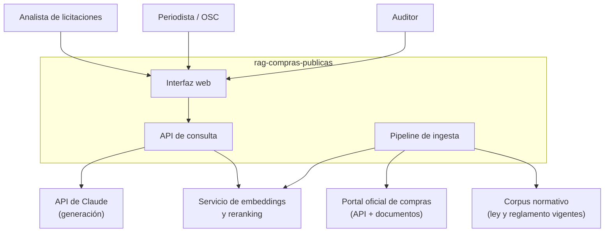
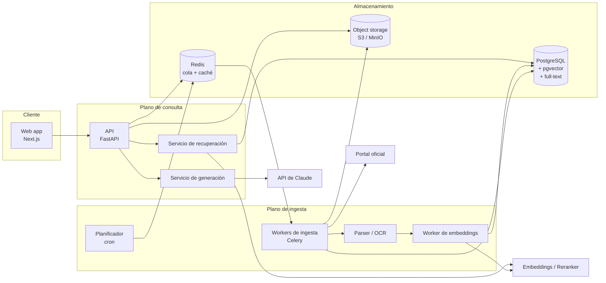
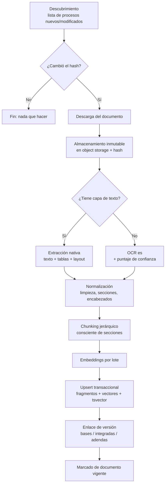
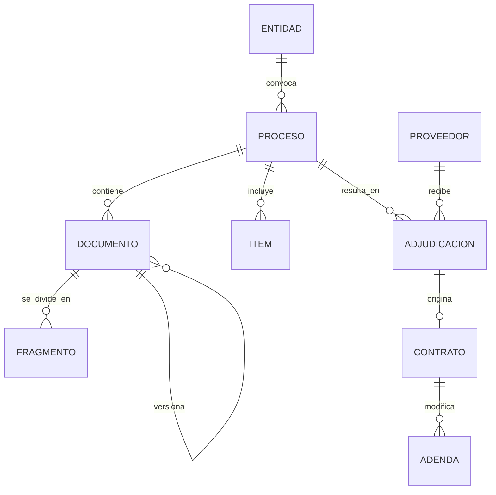
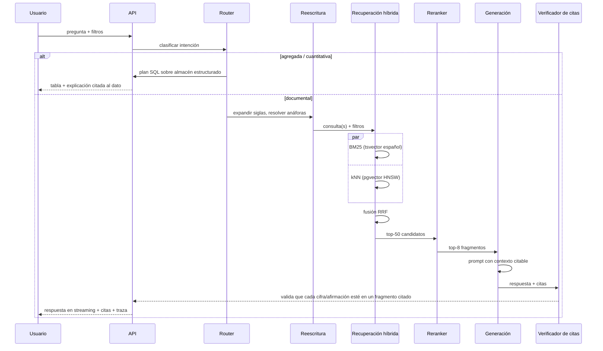

# Documento de Arquitectura de Software — RAG Compras Públicas

| Campo | Valor |
|---|---|
| Sistema | `rag-compras-publicas` |
| Versión | 1.0 (propuesta) |
| Fecha | 2026-08-31 |
| Documento relacionado | [`PRD.md`](./PRD.md) |
| Estado | Propuesta — pendiente de reconciliación con el código real |

> **Nota de procedencia.** El repositorio original no fue accesible (HTTP 404). Esta arquitectura es una propuesta de referencia coherente con el PRD, no una descripción de código existente. Las decisiones están registradas como ADRs en §12 para poder ser refutadas una por una.

---

## 1. Vista de contexto (C4 nivel 1)



**Frontera del sistema:** el sistema **solo lee** de los portales oficiales. Nunca escribe, nunca presenta ofertas, nunca se autentica como un postor.

## 2. Vista de contenedores (C4 nivel 2)



| Contenedor | Responsabilidad | Tecnología | Escalado |
|---|---|---|---|
| Web app | Búsqueda, respuesta citada, visor de PDF anclado a página | Next.js + TypeScript | Estático/CDN |
| API | Autenticación, límites de tasa, orquestación de la consulta, streaming (SSE) | FastAPI + Pydantic v2 | Horizontal, sin estado |
| Recuperación | Híbrido BM25 + vectorial, RRF, reranking, armado de contexto | Python, en proceso dentro de la API en v1 | Se extrae a servicio propio si el reranker se autohospeda |
| Generación | Prompt, llamada al modelo, verificación de citas | Python + SDK `anthropic` | Horizontal |
| Planificador | Dispara ingestas incrementales por fuente | cron / APScheduler | Instancia única con lock |
| Workers | Descarga, parseo, OCR, chunking, embeddings | Celery + Redis | Horizontal por cola |
| PostgreSQL | Verdad estructurada + índice vectorial + índice léxico | PostgreSQL 16 + pgvector + `tsvector` español | Vertical, réplica de lectura |
| Object storage | Documentos originales inmutables + texto extraído | S3 / MinIO | Gestionado |
| Redis | Cola de trabajos, caché semántica, límites de tasa | Redis 7 | Gestionado |

**Por qué un solo PostgreSQL y no un motor vectorial dedicado:** a la escala de la v1 (20 M fragmentos) pgvector con HNSW rinde de sobra, y mantener los metadatos y los vectores en el mismo motor permite **pre-filtrar por metadatos dentro de la misma consulta** —requisito RF-11— sin el baile de "filtro en un sistema, vectores en otro, intersección en memoria" que arruina el recall. Ver ADR-002 y la ruta de migración.

## 3. Pipeline de ingesta



### 3.1 Reglas de ingesta que no son negociables

1. **Idempotencia por hash.** La clave natural es `(fuente, id_externo, hash_contenido)`. Reejecutar la ingesta completa debe ser barato y no destructivo.
2. **El original nunca se pierde.** El PDF crudo se guarda antes de intentar parsearlo. Si el parser mejora, se reprocesa desde el original sin volver al portal.
3. **El fallo es visible.** Un documento que no se pudo parsear va a una tabla de cuarentena con el motivo. Nunca se descarta en silencio (RF-08).
4. **Cortesía con la fuente.** Un solo worker por dominio, límite de tasa configurable, `User-Agent` identificable con contacto, respeto de `robots.txt`.

### 3.2 Chunking

El chunking ingenuo por tamaño fijo destruye este dominio: parte cuadros de requisitos por la mitad y separa un plazo de la actividad a la que pertenece.

Estrategia adoptada:

- **Jerárquico por estructura.** Se detectan secciones (`CAPÍTULO`, `NUMERAL`, `ANEXO`, `TDR`) y el fragmento nunca cruza un límite de sección de primer nivel.
- **Tamaño objetivo 600–900 tokens**, solapamiento del 15 %.
- **Tablas como unidad atómica.** Una tabla se serializa completa a Markdown en un solo fragmento; si excede el máximo, se divide por filas repitiendo el encabezado.
- **Cabecera de contexto inyectada** en cada fragmento: entidad, número de proceso, tipo de documento, sección, página. Esto mejora la recuperación densa y hace que la cita sea verificable aunque el fragmento se lea aislado.

```
[Entidad: Municipalidad Distrital de X | Proceso: LP-005-2026 | Doc: Bases integradas v2 | Sección: 3.2 Requisitos de calificación | Pág. 41]
El postor deberá acreditar una facturación acumulada...
```

## 4. Modelo de datos



Esquema esencial (PostgreSQL):

```sql
CREATE TABLE documento (
    id              uuid PRIMARY KEY,
    proceso_id      uuid NOT NULL REFERENCES proceso(id),
    fuente          text NOT NULL,
    id_externo      text NOT NULL,
    tipo            text NOT NULL,            -- bases | integradas | adenda | contrato | tdr | acta
    version         int  NOT NULL DEFAULT 1,
    reemplaza_a     uuid REFERENCES documento(id),
    vigente         boolean NOT NULL DEFAULT true,
    uri_original    text NOT NULL,            -- object storage
    hash_contenido  text NOT NULL,
    ocr             boolean NOT NULL DEFAULT false,
    ocr_confianza   real,
    publicado_en    timestamptz,
    ingerido_en     timestamptz NOT NULL DEFAULT now(),
    UNIQUE (fuente, id_externo, hash_contenido)
);

CREATE TABLE fragmento (
    id            bigserial PRIMARY KEY,
    documento_id  uuid NOT NULL REFERENCES documento(id) ON DELETE CASCADE,
    orden         int  NOT NULL,
    pagina_inicio int  NOT NULL,
    pagina_fin    int  NOT NULL,
    seccion       text,
    texto         text NOT NULL,
    tsv           tsvector GENERATED ALWAYS AS (to_tsvector('spanish', texto)) STORED,
    embedding     vector(1024) NOT NULL,
    modelo_emb    text NOT NULL,              -- permite convivencia de versiones de embedding
    tokens        int  NOT NULL
);

CREATE INDEX ON fragmento USING hnsw (embedding vector_cosine_ops)
    WITH (m = 16, ef_construction = 64);
CREATE INDEX ON fragmento USING gin (tsv);
CREATE INDEX ON fragmento (documento_id, orden);
```

Notas de diseño:

- `modelo_emb` en la fila permite **reindexar por partes** al cambiar de modelo de embeddings, sin un big-bang.
- `pagina_inicio/fin` es lo que hace posible la cita accionable ("abrir el PDF en la página 41"); sin eso, la cita es decorativa.
- `vigente` + `reemplaza_a` resuelven P3/RF-06: por defecto se recupera solo sobre documentos vigentes, salvo que el usuario pida el histórico.

## 5. Ruta de consulta



### 5.1 Recuperación híbrida y fusión

- **Léxica:** `ts_rank_cd` sobre `tsvector` en español. Insustituible en este dominio: los números de proceso, códigos de ítem y nombres propios los recupera la búsqueda léxica, no la semántica.
- **Densa:** kNN coseno sobre HNSW. Recupera paráfrasis ("¿qué garantía piden?" vs. "garantía de fiel cumplimiento").
- **Fusión RRF:** `score(d) = Σ_l 1 / (k + rank_l(d))` con `k = 60`. Se elige RRF sobre la suma ponderada de puntajes porque **no requiere calibrar escalas** entre dos motores cuyos puntajes no son comparables, y es robusto sin ajuste por consulta.
- **Pre-filtro obligatorio:** los filtros de metadatos van en el `WHERE` de ambas ramas, no como post-filtro sobre el top-k. Post-filtrar es la causa número uno de "el sistema no encuentra algo que sí está".

### 5.2 Reranking

Los 50 candidatos fusionados pasan por un cross-encoder que puntúa cada par (consulta, fragmento) y deja los 8 mejores. Es el componente con mejor relación mejora/costo del pipeline: sube el recall efectivo del contexto sin ampliar la ventana ni el gasto de generación.

Opciones (a decidir por benchmark, ADR-004): reranker gestionado por API, o cross-encoder multilingüe autohospedado (familia BGE-reranker) en CPU si el volumen lo permite.

### 5.3 Generación

Modelo por defecto: **Claude Opus 5** (`claude-opus-5`), a través del SDK oficial `anthropic`.

Configuración:

| Parámetro | Valor | Razón |
|---|---|---|
| `model` | `claude-opus-5` | Mejor comportamiento en abstención y fidelidad a la evidencia, que es el KPI crítico (K1/K4) |
| `thinking` | `{"type": "adaptive"}` | Razonamiento adaptativo; el parámetro `budget_tokens` está removido en esta familia de modelos |
| `output_config.effort` | `medium` para consultas simples, `high` para comparativas y normativas | Palanca primaria de costo/calidad |
| Streaming | Sí (`messages.stream`) | RNF-01 exige primer token ≤ 2 s |
| `output_config.format` | Esquema con `respuesta`, `citas[]`, `confianza`, `sin_evidencia` | Hace verificable la salida por código, no por parseo de texto |
| Prompt caching | Prefijo estable: system + glosario del dominio + corpus normativo pequeño | Baja el costo de entrada; el contenido volátil (fragmentos, pregunta) va **después** del último punto de caché |

**Instrucciones del sistema (esencia):**

1. Responde **solo** con lo que está en los fragmentos entregados.
2. Cada afirmación factual lleva su cita `[doc_id, pág.]`.
3. Si la evidencia no alcanza, dilo explícitamente y señala qué haría falta. No completes con conocimiento general.
4. No emitas opinión jurídica ni recomendación de acción legal.
5. Reproduce cifras, plazos y códigos **literalmente**; no los redondees ni los conviertas.

**Verificador post-generación** (determinista, sin LLM): extrae todo número, fecha, monto y código de la respuesta y comprueba que aparezca en el texto de algún fragmento citado. Si no, la respuesta se marca y se degrada a "evidencia insuficiente". Es una red de seguridad barata contra R1 y sostiene K1 sin depender de que el modelo se porte bien.

### 5.4 Enrutamiento a SQL

"¿Cuántos procesos declaró desiertos esta entidad en 2025?" no es una pregunta de recuperación: es un `GROUP BY`. Contestarla con RAG produce conteos inventados a partir de 8 fragmentos.

El router clasifica la intención y, en el caso agregado, genera una consulta contra un conjunto **restringido de vistas de solo lectura** con lista blanca de columnas, límite obligatorio y timeout. La respuesta muestra la tabla, la consulta ejecutada y el rango de datos considerado. La cita, aquí, es el propio SQL.

## 6. Embeddings

No hay endpoint de embeddings en la API de Claude; el componente se resuelve fuera del modelo generador. Opciones consideradas:

| Opción | Ventaja | Riesgo |
|---|---|---|
| Embeddings multilingües gestionados por API (p. ej. Voyage AI) | Buena calidad en español, cero operación | Dependencia externa, costo por token, salida de datos |
| Modelo abierto autohospedado (familia BGE-M3 o multilingual-E5) | Sin costo variable, datos no salen, reindexado barato | Requiere GPU o tolerar latencia en CPU |

**Decisión: pendiente de benchmark (ADR-004).** El punto no negociable es que la elección se tome **midiendo `recall@10` sobre el golden set en español**, no por reputación del modelo. El esquema ya está preparado para convivencia de versiones (`fragmento.modelo_emb`), de modo que el cambio es reversible.

## 7. Costos

Costo de inferencia por consulta documental, con ~9 200 tokens de entrada (8 fragmentos + system + historial) y ~600 de salida:

| Modelo de generación | Entrada $/1M | Salida $/1M | Costo aprox. por consulta |
|---|---|---|---|
| Claude Opus 5 | 5,00 | 25,00 | **≈ 0,061 USD** |
| Claude Sonnet 5 | 2,00 | 10,00 | ≈ 0,024 USD |
| Claude Haiku 4.5 | 1,00 | 5,00 | ≈ 0,012 USD |

> **Tensión declarada con el KPI K7 (≤ 0,05 USD/consulta).** Con Opus 5 y 8 fragmentos, el costo por consulta queda **por encima** de la meta del PRD. Las palancas, en orden de preferencia (primero las que no sacrifican calidad):
> 1. **Prompt caching** del prefijo estable (system + glosario + normativa). Es la palanca gratuita y debe implementarse antes que cualquier otra.
> 2. **Caché semántica de respuestas** en Redis: en este dominio muchas preguntas se repiten casi literalmente entre usuarios sobre la misma convocatoria.
> 3. **Menos fragmentos, mejor elegidos.** Con reranking, bajar de 8 a 5 fragmentos suele no mover K1 y recorta ~35 % de la entrada.
> 4. **`effort` bajo/medio** en consultas simples.
> 5. **Batch API** (50 % de descuento) para todo el enriquecimiento offline: resúmenes por documento, extracción de metadatos, generación de preguntas del golden set. Esto no es la ruta de consulta y no debería pagar precio interactivo.
> 6. Solo si lo anterior no basta: **modelo más barato para tareas auxiliares** (clasificación de intención, reescritura de consulta), manteniendo Opus 5 en la generación citada. Degradar el modelo de generación es una decisión de producto, no técnica, y debe tomarla el dueño del producto midiendo K1 antes y después.

Costos no-LLM a presupuestar aparte: almacenamiento de objetos, OCR (por página), embeddings (ingesta inicial + reindexados) y cómputo del reranker.

## 8. Seguridad

| Área | Control |
|---|---|
| Autenticación | Claves de API por cliente en la ruta de servicio; OIDC para la interfaz web |
| Autorización | En v1 el corpus es público y homogéneo; el aislamiento por organización llega con multi-tenant (v2) y se implementará con RLS en PostgreSQL, no con filtros en el código de aplicación |
| Secretos | Variables de entorno provenientes de un gestor de secretos; nada de credenciales en el repositorio ni en el árbol de configuración |
| SQL | El enrutamiento a SQL nunca ejecuta texto libre del modelo contra tablas base: solo vistas de solo lectura, con lista blanca de columnas, `LIMIT` forzado y timeout, sobre un rol sin permisos de escritura |
| Inyección de prompt | Los documentos ingeridos son **datos, no instrucciones**. Los fragmentos se entregan delimitados y el system prompt establece que ninguna instrucción contenida en un documento debe obedecerse. Un PDF de bases es exactamente el vector de ataque esperable |
| PII | Detección y redacción de identificadores personales en las salidas; los anexos claramente personales (hojas de vida, copias de documento de identidad) se excluyen del índice |
| Registros | Sin PII ni texto completo de documentos en logs de aplicación; las trazas de consulta se guardan en la base con retención definida |
| Transporte | TLS obligatorio extremo a extremo; sin excepciones de verificación de certificados |
| Dependencias | Escaneo de vulnerabilidades y actualización de dependencias en CI |

## 9. Observabilidad

- **Trazas (OpenTelemetry)** con un span por etapa de la consulta: router → reescritura → recuperación léxica → recuperación densa → RRF → reranking → generación → verificación. La latencia se diagnostica mirando el span, no adivinando.
- **Métricas:** latencia por etapa (p50/p95/p99), `recall@k` en muestreo, tasa de abstención, tasa de fallo del verificador de citas, tokens y costo por consulta, profundidad de cola de ingesta, tasa de OCR y su confianza media, documentos en cuarentena.
- **Traza de RAG persistida** (RF-16): por cada consulta se guardan consulta original y reescrita, filtros, IDs de fragmentos con sus puntajes por rama y fusionado, versión de prompt, versión de modelo y versión de índice. Sin esto, ninguna regresión de calidad es depurable.
- **Alertas:** caída del volumen ingerido respecto de la media móvil (detecta R2 antes que el usuario), presupuesto de inferencia al 80 %, tasa de abstención fuera de banda, p95 de latencia degradado.

## 10. Evaluación y CI

**Golden set** versionado en el repositorio (`evals/golden/*.yaml`): pregunta, filtros, fragmentos relevantes esperados, respuesta de referencia y —clave— un subconjunto de preguntas **sin respuesta en el corpus**, para medir K4.

| Nivel | Qué mide | Cuándo corre |
|---|---|---|
| Unitarias | Chunking, normalización, parseo, RRF, verificador de citas | Cada push |
| Contrato de conectores | Que la fuente sigue devolviendo lo esperado (grabaciones VCR + un smoke diario contra la fuente real) | Push + diario |
| Recuperación | `recall@k`, `nDCG@10`, MRR sobre el golden set (sin llamar al generador: rápido y barato) | Cada push |
| Extremo a extremo | Groundedness, precisión de citas, abstención correcta, con juez LLM y revisión humana por muestreo | Cada PR que toque prompts, recuperación o generación |
| Carga | p95 con 50 consultas concurrentes | Semanal y previo a release |

**Umbrales que bloquean el merge:** `recall@10` ≥ 85 %, groundedness ≥ 92 %, precisión de citas ≥ 95 %, abstención correcta ≥ 95 %. Una caída de más de 3 puntos respecto de `main` bloquea aunque el valor absoluto siga sobre el umbral: detecta la erosión lenta.

## 11. Despliegue

- **Local:** `docker compose up` levanta API, worker, PostgreSQL con pgvector, Redis, MinIO y un cargador de datos de muestra (RNF-08). Es un requisito de producto, no una comodidad: sin entorno local reproducible, nadie mejora la recuperación.
- **Producción:** contenedores en un orquestador gestionado (Cloud Run / ECS / Kubernetes). API sin estado con autoescalado por concurrencia; workers escalados por profundidad de cola; PostgreSQL gestionado con réplica de lectura y respaldos con recuperación a un punto en el tiempo.
- **Migraciones:** Alembic, hacia adelante y compatibles con la versión anterior; el despliegue nunca depende de una migración destructiva.
- **Reindexación sin caída (RF-21):** el nuevo índice se construye en tablas sombra y se activa con un cambio atómico de la vista/alias que consulta el servicio.
- **Entornos:** `dev` (datos de muestra) → `staging` (réplica parcial del corpus, evaluación completa) → `prod`.

## 12. Registro de decisiones (ADR)

### ADR-001 — RAG con recuperación híbrida frente a fine-tuning
**Decisión:** RAG, sin fine-tuning del modelo generador.
**Razón:** el corpus cambia a diario y el requisito duro es la citabilidad. Un modelo ajustado memoriza sin poder citar y queda obsoleto en semanas. El fine-tuning solo se consideraría, más adelante, para el reranker o el clasificador de intención, no para la generación.

### ADR-002 — PostgreSQL + pgvector como único almacén
**Decisión:** un solo motor para metadatos, texto e índice vectorial.
**Razón:** permite pre-filtrado por metadatos en la misma consulta (RF-11), transaccionalidad entre el documento y sus fragmentos, y una operación mucho más simple.
**Consecuencia y salida:** por encima de ~50 M fragmentos o si el reranking léxico avanzado se vuelve central, se migra la rama léxica a OpenSearch o el índice denso a Qdrant, manteniendo PostgreSQL como fuente de verdad. La interfaz `Retriever` aísla ese cambio.

### ADR-003 — Fusión por RRF en vez de suma ponderada de puntajes
**Decisión:** Reciprocal Rank Fusion con `k = 60`.
**Razón:** los puntajes BM25 y de similitud coseno no son comparables ni estables entre consultas; ponderarlos exige una calibración que se desajusta. RRF opera sobre rangos y funciona sin ajuste fino.

### ADR-004 — Elección de embeddings y reranker diferida a benchmark
**Decisión:** no fijar el modelo en el diseño; medirlo sobre el golden set en español y registrar el resultado como enmienda a este ADR.
**Razón:** el rendimiento en español jurídico-administrativo no se predice desde los rankings genéricos en inglés. El esquema (`fragmento.modelo_emb`) ya soporta convivencia de versiones para que la decisión sea reversible.

### ADR-005 — Claude Opus 5 para la generación citada
**Decisión:** `claude-opus-5` con razonamiento adaptativo y salida estructurada.
**Razón:** el KPI que define el producto es no alucinar y abstenerse correctamente; ahí es donde la capacidad del modelo se paga sola. Las palancas de costo (§7) se aplican **antes** de considerar un modelo menor en la ruta de generación.

### ADR-006 — Verificador determinista de citas posterior a la generación
**Decisión:** validar por código que cifras, fechas y códigos de la respuesta existan en los fragmentos citados.
**Razón:** los controles por prompt son probabilísticos; el riesgo R1 es crítico y merece una barrera determinista. Es barato y no depende del modelo.

### ADR-007 — Enrutamiento de preguntas agregadas a SQL
**Decisión:** las preguntas cuantitativas no pasan por RAG.
**Razón:** contar sobre un top-k es estructuralmente incorrecto. Se responde desde el almacén estructurado, con la consulta visible como forma de cita.

### ADR-008 — Tratar el contenido ingerido como dato no confiable
**Decisión:** ninguna instrucción contenida en un documento ingerido se ejecuta; los fragmentos van delimitados y el system prompt lo establece explícitamente.
**Razón:** cualquiera puede publicar un PDF en un portal público. Es la superficie de inyección de prompt más obvia del sistema.

## 13. Estructura propuesta del repositorio

```
rag-compras-publicas/
├── src/
│   ├── api/                 # FastAPI: rutas, esquemas, autenticación, límites de tasa
│   ├── ingest/
│   │   ├── connectors/      # un módulo por fuente, interfaz común
│   │   ├── parsing/         # PDF nativo, OCR, tablas
│   │   ├── chunking/
│   │   └── pipeline.py
│   ├── retrieval/           # léxico, denso, RRF, reranking, filtros
│   ├── generation/          # prompts (versionados), cliente del modelo, verificador de citas
│   ├── routing/             # clasificación de intención, SQL seguro
│   ├── domain/              # modelos de dominio, normalización de montos/fechas/identificadores
│   └── db/                  # SQLAlchemy, migraciones Alembic
├── evals/
│   ├── golden/              # golden set versionado
│   └── runners/
├── web/                     # Next.js
├── infra/                   # docker-compose, manifiestos, terraform
├── docs/
│   ├── PRD.md
│   └── ARQUITECTURA.md
└── tests/
```

## 14. Trabajo pendiente antes de implementar

1. Confirmar la **jurisdicción y la fuente inicial** (PRD §11-S1): condiciona el primer conector y el vocabulario del dominio.
2. Reconciliar este documento con el **código real** del repositorio original, cuando sea accesible.
3. Ejecutar el **benchmark de embeddings y reranker** en español (ADR-004) sobre un golden set semilla de 100 preguntas.
4. Resolver la **tensión de costos** del §7 con el dueño del producto: o se implementan las palancas 1–5 y se alcanza K7, o se ajusta K7 en el PRD. No dejarlo implícito.
5. Definir la **política de retención** de trazas de consulta y de datos personales redactados.
